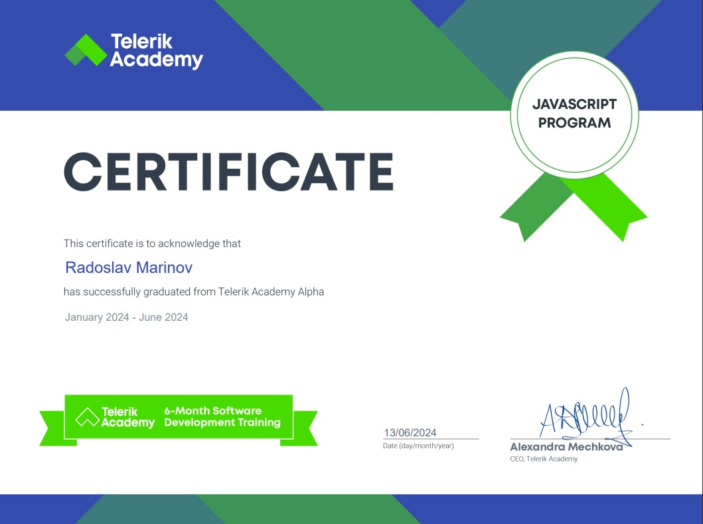
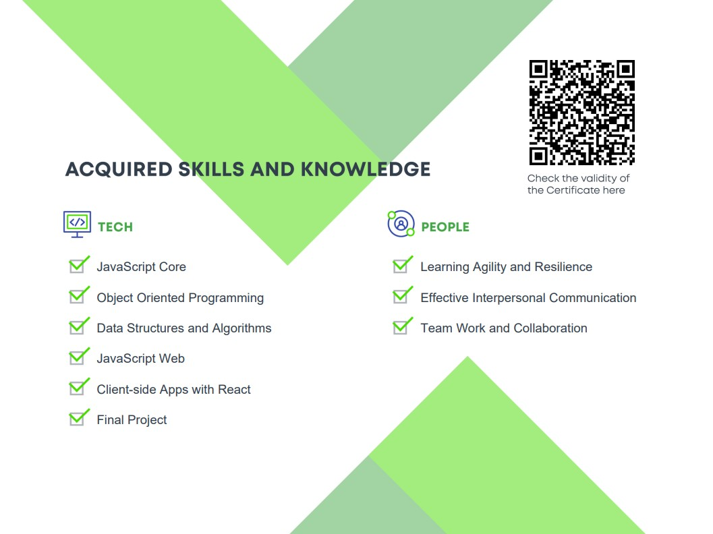

  

###

<h1 align="center">Hey 👋 I'm Radoslav</h1>

###

  
  

###

<h2 align="left">About me</h2>

###

 

I am a software developer with a passion for web development. I have experience with JavaScript, TypeScript, React, Next.js, Node.js, and Firebase. I am also familiar with C# and have experience with HTML, CSS, and Git.  🎓 Education: Telerik Academy: Completed Alpha JavaScript Track.  📧 Feel free to connect! Let’s build something amazing together. 🚀

###

<h2 align="left">I code with</h2>

###

  
  
  
  
  
  
  
  
  
  
  
  
  
  
  
  
  
  
  
  
  
  
  

###

<h2 align="left">My certificate</h2>

###

 

###

<h2 align="left">Some statistics</h2>

###

  

###

  

###

  
  

###

 

###
